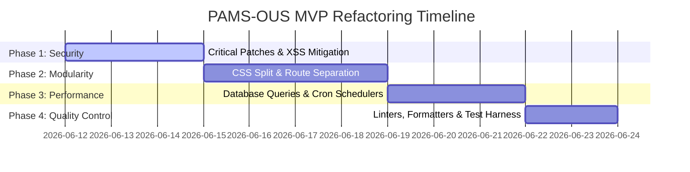

# SDLC Refactoring & Security Remediation Plan

This document outlines the software development lifecycle (SDLC) plan to address critical security vulnerabilities, clean up code quality, and improve system modularity for the **PAMS-OUS**. 

To align with the project constraints, **full architectural overhauls (such as introducing React, Next.js, or backend frameworks like NestJS) are explicitly out of scope**. Such changes require forking the entire codebase and will be reserved for a future iteration of the project.

---

## 1. Objectives & Scope

### In-Scope
* **Vulnerability Remediation**: Patching critical and high-severity security vulnerabilities (JWT fallback secrets, IDOR, input impersonation, unguarded routes, and DOM-based XSS).
* **Code Modularization**: Splitting monolithic files (such as `server.js` sync routes and `style.css`) into focused, single-purpose components.
* **Performance & Data Integrity**: Offloading in-memory data processing to the database layer and scheduling system jobs via cron-style triggers instead of HTTP request handlers.
* **Developer Experience**: Introducing linting, formatting, and standard error handling to prevent code quality decay.

### Out-of-Scope
* Migrating frontend pages to React, Vue, Svelte, or Next.js.
* Migrating backend services to Express alternatives or NestJS.
* Introducing compile-time template engines or bundlers (Vite/Webpack) that require restructuring the static file hosting architecture.

---

## 2. Refactoring Phases

The refactoring roadmap is divided into four chronological phases, prioritizing security patching first:

### Phase 1: Critical Security Patching (Days 1–3)
* **Goal**: Harden the system against external and internal vectors of attack.
* **Key Tasks**:
  * Enforce strict requirement of `JWT_SECRET` in environment configurations and remove default fallback secrets.
  * Resolve Insecure Direct Object Reference (IDOR) in task lists by determining the active user profile strictly from JWT claims.
  * Eliminate impersonation vulnerabilities by binding logging ownership to authenticated sessions.
  * Apply authorization guards on all REST endpoints and Socket.io event channels.
  * Integrate an HTML escaping utility in frontend scripts to shield against DOM-based XSS.

### Phase 2: Code Modularization & Cleanup (Days 4–7)
* **Goal**: Reduce technical debt, improve readability, and prevent cascade bugs.
* **Key Tasks**:
  * Extract User/Group synchronization routes from the centralized entry point ([server.js]) into dedicated controller modules.
  * Split the monolithic styling sheet ([style.css]) into separate stylesheets organized by variables, utilities, components, and pages.
  * Standardize backend CORS policies to use explicit white-listing rather than unsafe substring matching.

### Phase 3: Performance & Background Operations (Days 8–10)
* **Goal**: Optimize database usage and reduce GET request latency.
* **Key Tasks**:
  * Refactor personal task filters to query directly from MySQL using SQL `WHERE` clauses, replacing memory-intensive JavaScript array filtering.
  * Move daily task resets and overdue checking scripts out of the GET handler pipeline and into a background cron execution context (e.g., using `node-cron`).

### Phase 4: Tooling & Quality Assurance (Days 11–12)
* **Goal**: Lock in guidelines and establish automated code quality checks.
* **Key Tasks**:
  * Configure ESLint and Prettier for the backend and frontend to enforce formatting standards.
  * Implement unified error handling wrappers to block internal MySQL server errors from leaking schema structures to the API responses.

---

## 3. Acceptance Criteria

Before any code updates are merged into the repository, they must satisfy the following validation criteria:
1. **Security**: A subsequent audit report must verify that all critical/high issues are resolved and no active XSS vectors exist in input rendering.
2. **Regression**: All existing features (Task Board, Accomplishment Logs, Reports, User/Group management) must function exactly as specified in the prototype.
3. **Asset Footprint**: The monolithic CSS split must not introduce layout distortions, flash of unstyled content (FOUC), or broken link pathways.
4. **Latency**: GET request latency for retrieving tasks must not degrade under database loads up to 10,000 tasks.
